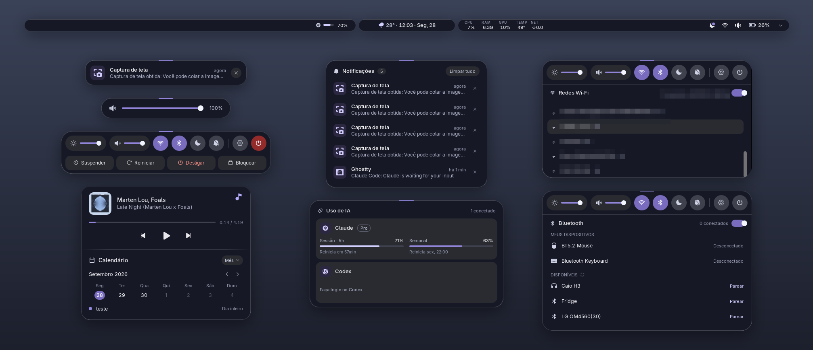

# Island

Extensão do GNOME Shell que troca o painel superior por três pílulas flutuantes. A do meio, a **ilha**, muda de tamanho conforme o contexto, no estilo Dynamic Island, e concentra notificações, música, volume, brilho, calendário e controles rápidos.



## O que tem

- **Ilha central**: relógio, dia e clima quando está compacta; expande para notificações, música, volume/brilho, calendário, controles rápidos, Wi‑Fi (com senha) e Bluetooth.
- **Notificações**: aparecem na ilha e ficam numa lista. Notificações do Chrome/Brave/Chromium mostram o serviço de origem (WhatsApp, Discord, YouTube…); no Firefox isso não funciona, porque ele não informa a origem. Tem modo não perturbe.
- **Música**: qualquer player MPRIS (Spotify, navegador, etc.), com capa e controles.
- **Cartão central**: música + calendário da semana ou do mês, com os eventos das contas do GNOME.
- **Clima**: cidade das preferências, localizações do GNOME ou Geoclue.
- **Controles rápidos** (`Super+S`): volume, brilho, Wi‑Fi, Bluetooth, modo noturno, não perturbe, Configurações e linha de energia (suspender, reiniciar, desligar, sair, bloquear).
- **Hardware**: CPU, RAM, GPU (Intel/AMD), temperatura e rede.
- **Bateria**: nível e carregamento.
- **Uso de IA**: limites de uso do Claude e do Codex, lidos das credenciais dos CLIs.

## Como funciona

A ilha tem um **modo** por vez. Há dois tipos:

- **Transitórios** (`notif`, `music`, `volume`, `brightness`): abrem sozinhos por um evento e fecham depois de alguns segundos. Passar o mouse por cima segura a ilha aberta.
- **Fixos** (`stack`, `calendar`, `quick`, `wifi`, `bt`, `ai`): abrem por clique ou atalho e ficam até clique fora, `Esc` ou outro gatilho.

Eventos automáticos nunca atropelam o que você abriu: com um modo fixo aberto, uma notificação vira um banner abaixo da ilha e trocar de faixa não abre a música.

Clicar na ilha compacta abre o cartão central (ou o calendário, conforme as preferências). Clicar numa notificação abre a lista.

A máquina de estados fica em `src/core/` (TypeScript puro, testado com Vitest). `src/system/` fala com o sistema (MPRIS, NetworkManager, BlueZ, UPower, EDS, GWeather), e `src/ui/` só desenha o estado com St/Clutter.

## Requisitos

- GNOME Shell 50 em Wayland. Só é validado no Arch, mas o código não depende de nada específico do Arch.
- Para compilar: Node.js 22, npm e `glib-compile-schemas` (vem com a GLib).
- Opcionais, conforme o recurso:
  - Calendário: `evolution-data-server` com uma conta configurada no GNOME
  - Clima: `libgweather-4` e, sem cidade configurada, Geoclue com a localização ligada
  - Uso de IA: login feito no [Claude Code](https://claude.com/claude-code) (`~/.claude/.credentials.json`) e/ou no Codex CLI (`~/.codex/auth.json`)

## Instalação

```sh
git clone https://github.com/CaioNazario/island-desktop.git
cd island-desktop
npm ci
./install.sh
```

O `install.sh` compila e copia a extensão para `~/.local/share/gnome-shell/extensions/island@caionazario.dev`. Depois:

1. Faça logout e login (o Wayland não recarrega extensões em quente).
2. Ative a extensão:

   ```sh
   gnome-extensions enable island@caionazario.dev
   ```

Preferências (ação do clique na ilha, cidade do clima, provedores de IA):

```sh
gnome-extensions prefs island@caionazario.dev
```

### Atualizar

```sh
git pull
npm ci
./install.sh
```

E faça logout/login.

### Desinstalar

```sh
gnome-extensions disable island@caionazario.dev
./install.sh --uninstall
```

Ao desativar a extensão, o painel padrão do GNOME volta.

## Uso de IA: leia antes

A pílula de uso de IA não usa nenhuma API oficial:

- Lê o token OAuth de `~/.claude/.credentials.json` (Claude Code) e de `~/.codex/auth.json` (Codex CLI).
- Com esse token, chama endpoints de uso **não documentados** da Anthropic e da OpenAI. O do Claude só responde com o User-Agent do `claude-cli`, então a extensão se identifica como ele.
- Nunca escreve nos arquivos de credencial e nunca renova token. Quando o CLI renova, a extensão relê o arquivo.
- Os endpoints podem mudar ou sumir a qualquer momento. Se a resposta vier num formato inesperado, o cartão mostra erro, e o resto da extensão continua funcionando.

Se não quiser nada disso, desligue os provedores nas preferências. Sem credencial, a pílula mostra só "IA".

## Limitações

- Só GNOME Shell 50 e Wayland. Validado apenas no Arch.
- GPU NVIDIA não aparece no bloco de hardware (só Intel e AMD).
- Notificações do Firefox não mostram o serviço web de origem, porque o Firefox não manda essa informação.
- Sem tema claro, sem botões de ação nas notificações, sem bandeja AppIndicator e sem troca de layout de teclado na barra.
- Sem botão Atividades e sem auto-ocultar: a barra sempre reserva o topo.
- Não está no extensions.gnome.org; a instalação é só pelo `install.sh`.

## Desenvolvimento

```sh
npm ci
make test    # Vitest
make lint    # ESLint, Prettier e tsc
make build   # compila para dist/
make dev     # abre um GNOME Shell aninhado (--devkit)
```

O Shell aninhado do `make dev` carrega a extensão instalada, não o `dist/`: rode `./install.sh` antes pra ele pegar a versão atual.

O comportamento está especificado em [`specs/`](specs/) (comece pelo [`00-visao-geral.md`](specs/00-visao-geral.md)), e o visual de referência em [`design/`](design/). As convenções do projeto estão no [`AGENTS.md`](AGENTS.md).

Para diagnóstico, existe um log de debug desligado por padrão:

```sh
touch ~/.cache/island-debug   # liga (vale depois de logout/login)
journalctl -b -o cat /usr/bin/gnome-shell | grep ISLANDDBG
rm ~/.cache/island-debug      # desliga
```

## Licença

[GPL-3.0-or-later](LICENSE).
